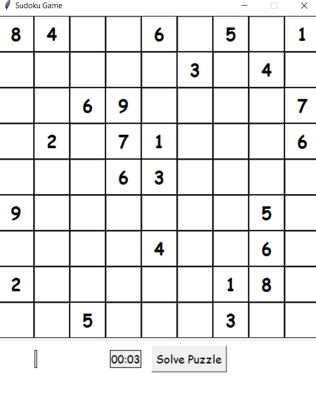
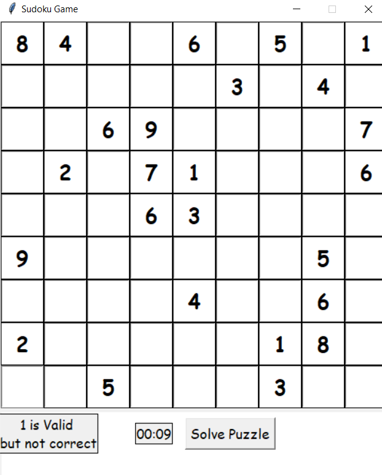
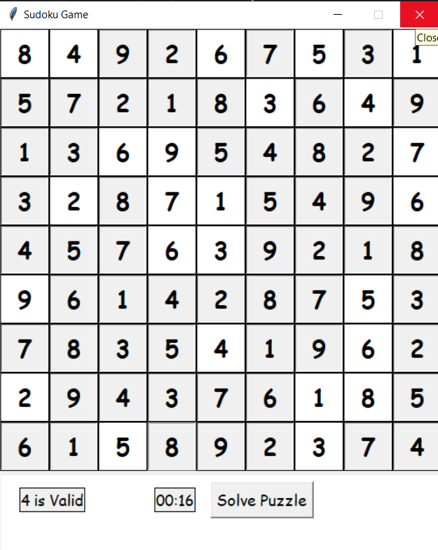
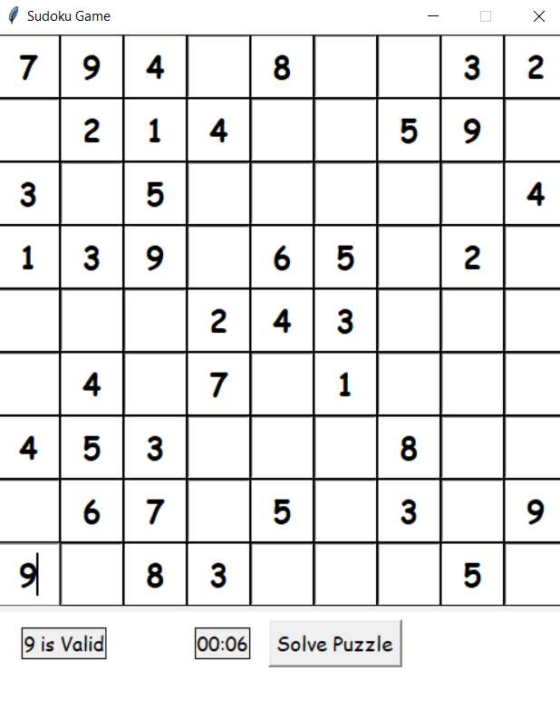
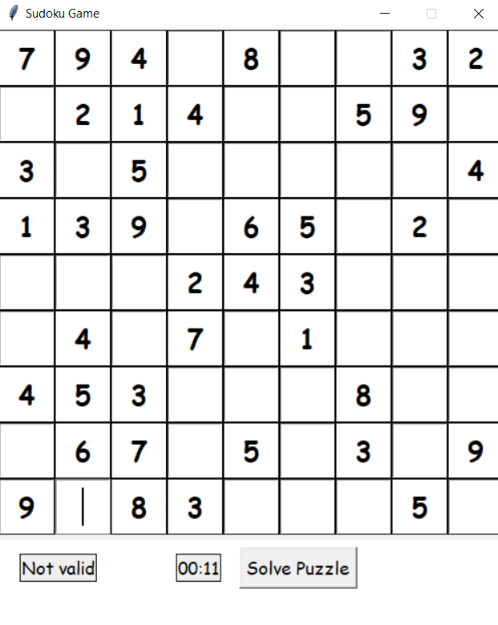

# README.md

This repo contains code for GUI based Sudoku game.
Th following files are present:

1. solver.py := the file that contains the actual solver that solves the puzzle.The algorithm is based on backtracking.
2. puzzles.py := the file that contains demo puzzles.
3. gui_solver.py :=  the file that renders/displays the puzzle in a GUI. The GUI is made using tkinter.

## Screenshots of Gameplay

**Get the mode for playing**


**Initial screen**



**Valid but Wrong entry**



**Solved Puzzle**



**Valid and Correct Entry**



**Invalid Entry**



## How to run

Open a terminal, move to this directory and enter following command:

```shell
python gui_solver.py
```
